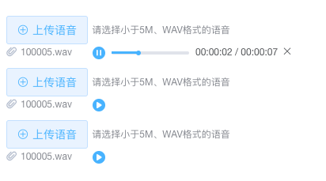

# 音频组件开发实践

最近公司迭代的项目中，新增了音频播放功能，填了不少音频的坑，总结一下：

## 需求：

交互需求：

1. 上传：点击按钮上传语音，返回文件id（上传文件的范畴，本文不会阐述）
2. 播放：点击播放按钮，异步获取语音播放src，音频载入之后播放
3. 操作：语音支持播放、暂停、停止、进度拖动等操作

当然还有一些隐性需求：

1. 一个界面可能存在多个播放文件
2. 随时播放一个语音，其它语音应当暂停
3. 播放过程中，用户重新上传新的语音，此时播放应停止

实现效果如下图所示：（当然，这只是项目用到的一部分，项目中还有其他页面也用到了这个组件，那么就更考验组件的健壮性和可拓展性了。）



## 按需实现

### 一个界面可能存在多个播放文件

我们对音频的操作，通常是先获取这个音频 DOM Element，通过对它的操作，实现想要达到的效果，如果你只是设定一个`audio`这样单薄的ref名称，恐怕会有些问题，因此我给每个音频设定了一个唯一的ref名称。

``` js
<template>
  <audio :src="audioSrc" :ref='uniqueId' :data-key="uniqueId" hidden></audio>
</template>
<script>
export default {
  data () {
    return {
      // uniqueId() 是随机生成字符串的方法
      uniqueId: uniqueId(),
      audioSrc: '',
    }
  },
  computed: {
    audioElement () {
      return this.$refs[this.uniqueId]
    }
  },
}
</script>
```

### 暂停其他语音

注意到上面的代码，我在给 audio 添加属性的时候，多添加了一个 `data-key`的属性，那就是为了暂停其他语音而使用的，作为我要操作页面其他音频而设置的标识：

``` js
// 暂停其他语音的方法
pauseOthers (except) {
  var audios = document.querySelectorAll('audio')
  ;[].forEach.call(audios, audio => {
    if (audio.dataset['key'] !== except.uniqueId) {
      audio.pause()
    }
  })
}
// 调用的时候
this.pauseOthers (this)
```

### 异步获取语音src，音频载入之后播放

我想这就是项目坑点之一，因为音频src并不是上传语音就返回的，上传语音只返回了语音id，我们需要通过id再去异步请求一次，才能获取到src。

基于这样的前提，播放操作做了两点考虑（单例模式思维）：

- 为什么点击播放再获取语音src？虽然也可以进入界面就请求src，但是如果用户不点击播放，就白白浪费了不需要的请求，基于性能的考虑，决定点击播放后再进行请求。
- 并不需要每次点击都重新请求一次，只有未获取过src的音频需要重新请求。

具体实现：

1. 播放按钮绑定`togglePlay()`事件
2. 判断`audioSrc`是否有值
    - 如果有值，直接进行播放，绑定相关事件，暂停其他语音
    - 如果没有值，设置loading并进行异步请求，将返回结果赋值给`audioSrc`，监听音频 `canplay`
3. 监听音频 `canplay` （这边有一个坑点，后面会提到）
    在canplay的回调中，loading结束，绑定相关事件，暂停其他语音

为什么相关事件的绑定放在 `canplay` 中？ 不然你可能会出现下面的报错：

``` bash
Uncaught (in promise) DOMException: The element has no supported sources.
```

所以，答应我，基于audio播放的 **事件** 或是 **属性** ，都放在 `canplay` 的回调之后。

相关事件包括（本组件中）：

1. 监听事件 `timeupdate` : 控制进度条展示
2. 监听事件 `pause` : 监听按钮 播放/暂停 样式
3. 设置属性 `currentTime` ： 控制进度拖动或者停止语音
4. 监听事件 `error` ： 监听播放错误

### 音频的操作

#### 播放与暂停

按钮的样式通过设置一个变量作为状态值，`paly()` 和 `pause()` 的时候分别改变状态值。

其它具体逻辑上文描述比较清楚，不再赘述。

#### 停止、进度拖动

- 停止：暂停音频，并将`currentTime`设置为0
- 进度拖动：根据拖动位置计算`currentTime`值，并设置`currentTime`

两个操作都涉及到了`currentTime`的设置，我们在这里遇到了两个坑：

1. 设置currentTime无效
    查询资料后发现是后端的锅，具体解决办法链接在这里：[HTML5 audio ,在chrome中设置currentTime无效](https://segmentfault.com/q/1010000002908474)

2. 设置currentTime继续播放

    一开始仍然以为是后端的锅，因为当我静态设置一个 audioSrc 的时候，是没有问题的，但是当我动态设置，就会出现这样的问题：无论我是播放状态还是暂停状态，设置到相对应的`currentTime`都会继续播放。

    通过排查，发现当我设置`currentTime`会再次触发一次 `canplay`事件， `canplay` 的回调是绑定播放的相关操作，因此会继续播放。

    解决办法，温习了一遍[addEventListener](https://developer.mozilla.org/zh-CN/docs/Web/API/EventTarget/addEventListener)的语法，绑定`canplay`事件最多只调用一次。
    ``` js
    this.audioElement.addEventListener('canplay', () => {
          // ...相关操作
    }, {
      once: true
    })
    ```

### 音频的打断

音频的打断包括两种情况：

1. 组件 `destroyed`
2. 重新上传新的语音

第一种情况，解绑相关事件，释放内存。

第二种情况，具体描述一下：

当用户重新上传新的语音，不论此时语音暂停还是播放状态，都应该停止。

我们通过 `watch` 监听 id (上传返回来的音频id)，当id变化的时候，将 `audioSrc` 清空，以免播放旧的音频内容。

然而，仅仅这样是不够的，如果监听 `error` 事件，就会发现报错，解决的办法还是解绑相关事件，即，我们在 `canplay` 回调中的绑定的相关事件，让audio恢复初始状态，等到下一次播放的时候，需要重新请求新的src，回到上面播放的部分。

## 拓展

在解决问题的过程中，也查询到了一些实用的知识点，虽然在应用中没有运用到，但是这些知识点看起来似乎挺有用的，为了下次遇到其他坑能快速找到解决办法，先把这些知识点记录下来。

### `canplay` 与 `canplaythrough` 辨析

- 当浏览器能够开始播放指定的音频/视频时，会发生 `canplay` 事件。
- 当浏览器预计能够在不停下来进行缓冲的情况下持续播放指定的音频/视频时，会发生 `canplaythrough` 事件。
- 了解其他[媒体相关事件](https://developer.mozilla.org/zh-CN/docs/Web/Guide/Events/Media_events)

### `HTMLMediaElement.play()` 返回 Promise

`<video>`或 `<audio>` 的 `play()`返回一个 `Promise`，如果播放成功，Promise状态变成`fulfilled`，如果播放失败，状态变为`rejected`并提供错误信息。

``` js
var playPromise = document.querySelector('video').play();

// In browsers that don’t yet support this functionality,
// playPromise won’t be defined.
if (playPromise !== undefined) {
  playPromise.then(function() {
    // Automatic playback started!
  }).catch(function(error) {
    // Automatic playback failed.
    // Show a UI element to let the user manually start playback.
  });
}
```

### video 412错误

> 412 一般是因为服务器的 If-Unmodified-Since 或 If-None-Match 未实现

``` js
// 解决办法
media.addEventListener('error', function (e) {
   var date = new Date();
   var milliSecs = date.getMilliseconds();
   var curr_src = $(media[0]).attr('src');
   var curr_src_arr = curr_src.split("?");
   var new_src = curr_src_arr[0]+"?t="+milliSecs;

   $(media[0]).attr('src',new_src);
   $(media[0]).find('source').attr('src',new_src);
   media[0].load();
}, false);
```

暂时完。

后续如果测试妹妹发现了什么bug，我会继续填坑记录滴。