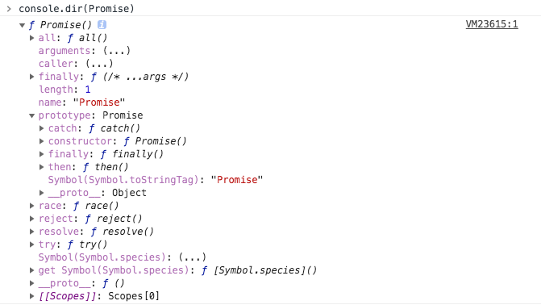

# Promise 知识树

## Promise基本手册

首先我们再控制台打印一下Promise : `console.dir(Promise)`



可以看出Promise是一个构造函数，自己身上有`all`、`race`、`reject`、`resolve`等方法，原型上有`then`、`catch`等方法。

再对照MDN [Promise](https://developer.mozilla.org/en-US/docs/Web/JavaScript/Reference/Global_Objects/Promise)确认一下：

1. Promise是构造函数
2. 基本语法如下
    ``` js
      // 创建新的promise实例对象
      const p = new Promise(function(resolve, reject) {
        console.log('Create a new Promise.');
      });
    ```
3. Promise有三状态:
    - pending: 初始状态（等待）。
    - fulfilled: 操作完成。
    - rejected: 操作失败。
4. Promise自身方法有：
    - `Promise.all(iterable)`
    - `Promise.race(iterable)`
    - `Promise.reject(reason)`：异步操作执行失败后的回调函数
    - `Promise.resolve(value)`：异步操作执行成功后的回调函数和
5. Promise原型方法有
    - `Promise.prototype.catch(onRejected)`
    - `Promise.prototype.then(onFulfilled, onRejected)`
    - `Promise.prototype.finally(onFinally)`
6. Promise的状态变化过程
    - pending 状态的 Promise 对象触发fulfilled 状态后，传递一个值给相应的状态处理方法，在then中调用onfulfilled 方法。
    - pending 状态的 Promise 对象触发rejected 状态后，传递失败信息给相应的状态处理方法，在then中调用onrejected 方法，或在catch中捕获。
    - 因为 `Promise.prototype.then` 和  `Promise.prototype.catch` 方法返回新的promise 对象， 所以它们可以被链式调用。
    

## [Promise A+ 规范](http://malcolmyu.github.io/malnote/2015/06/12/Promises-A-Plus/)

Promise的设计初衷是避免异步回调地狱. 它提供更简洁的api, 同时展平回调为链式调用, 使得代码更加清爽, 易读.


## 实现一个Promise

## jquery中的Promise —— Deferred对象

jquery用$.Deferred实现了Promise规范，因为jQuery本身的设计风格，jQuery.Deferred()并没有完全遵循Promises/A规范。

先回顾一下jQuery的ajax操作的传统写法：

``` js
$.ajax({
　　　　url: "url",
　　　　success: function(){
          console.log("成功")
　　　　},
　　　　error:function(){
　　　　　　console.log("失败")
　　　　}
　　});
```

$.ajax()接受一个对象参数，这个对象包含两个方法：success方法指定操作成功后的回调函数，error方法指定操作失败后的回调函数。

deferred对象：

1. 链式写法
2. 允许你添加多个回调函数。
3. 为多个事件指定一个回调函数

``` js
$.ajax("url")
　　.done(function(){ console.log("成功") })
　　.fail(function(){ console.log("失败") });
```

done()相当于success方法，fail()相当于error方法。

``` js
$.ajax("url")
　　.done(function(){ console.log("成功1")} )
　　.fail(function(){ console.log("失败") } )
　　.done(function(){ console.log("成功2")} );
```

``` js
$.when(runAsync(), runAsync2(), runAsync3())
.then(function(data1, data2, data3){
    console.log('全部执行完成');
    console.log(data1, data2, data3);
});
```