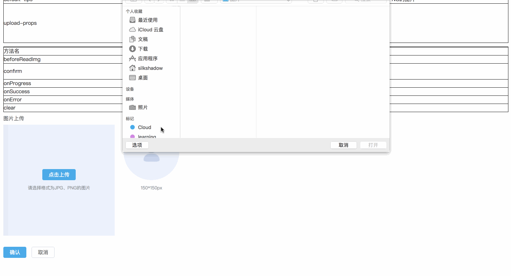
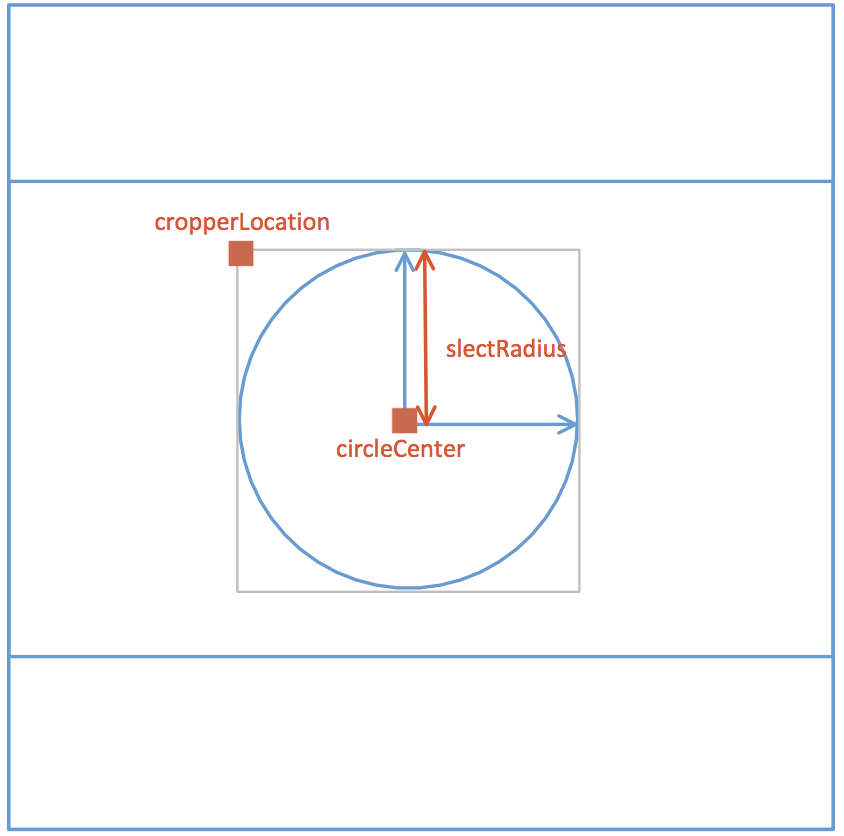

# vue 实现剪裁图片并上传服务器

## 效果图

预览链接 [点击预览](https://phoebecodespace.github.io/emic-element/#/cropper)


## 需求

- [x] 预览：根据选择图像大小自适应填充左侧裁剪区域
- [x] 裁剪：移动裁剪框右侧预览区域可实时预览
- [x] 上传&清空：点击确认上传裁剪图片，点击取消按钮清空图像
- [ ] 裁剪框可调节大小

## 实现步骤

> methods:funName() -  对应源码中methods中的funName方法
> data:dataName     -  对应源码中data中的dataName数据

### 1. 图片选择与读取

- **选择图片**：(methods:selectPic)
    使用`input[type="file"]`弹出选择图片框，js 主动触发点击事件;
- **读取图片**： (methods:readImage)
    创建图片对象，使用[createObjectURL](https://developer.mozilla.org/zh-CN/docs/Web/API/URL/createObjectURL)显示图片。
    `objectURL = URL.createObjectURL(blob)`;

### 2. 在canvas中展示图片

**需要掌握的 canvas 相关知识**:

1. 清空画布 `ctx.clearRect(x,y,width,height)`;
2. 填充矩形 `ctx.fillRect(x,y,width,height)`;
3. 绘制圆弧 `ctx.arc(x,y,r,startAngle,endAngle,counterclockwise)`;
   绘制矩形 `ctx.rect(x,y,width,height);`
4. 绘制图像 [drawImage](https://developer.mozilla.org/zh-CN/docs/Web/API/CanvasRenderingContext2D/drawImage)
    
    ``` bash
        # 语法
        ctx.drawImage(image, dx, dy);
        ctx.drawImage(image, dx, dy, dWidth, dHeight);
        ctx.drawImage(image, sx, sy, sWidth, sHeight, dx, dy, dWidth, dHeight);
        # 参数
        image                # 绘制的元素（可以为HTMLImageElement，HTMLVideoElement，或者 HTMLCanvasElement。）
        dx,dy                # 目标画布(destination canvas)左上角的坐标
        dWidth,dHeight       # 目标画布(destination canvas)上绘制图像宽高
        sx,sy                # 源画布(source canvase)左上角的坐标
        sWidth,sHeight       # 源画布(source canvase)选择的图像宽高
    ```
5. 剪裁图片 `ctx.clip()`;

**具体步骤**:

- **计算canvas宽高**：(methods:calcCropperSize)
    根据图片大小，计算canvas宽高（data:cropperCanvasSize），以致图片能够在裁剪区域自适应展示，并确定裁剪的左上角位置（data:cropperLocation）。
- **绘制左侧裁剪区域图像**：(methods:renderCropperImg)

> 裁剪区域vue data示意图：


- **绘制右侧预览图片**：(methods:renderPreviewImg)

### 3. 移动裁剪框

**知识点**:
onmousedown、onmousemove、onmouseup

**具体实现**:
> methods:drag()

记录鼠标坐标，鼠标移动根据偏移量计算圆心位置。

``` js
      canvas.onmousedown = e => {
        let [lastX, lastY] = [e.offsetX, e.offsetY];
        self.movement = true;
        canvas.onmousemove = e => {
          self.circleCenter = {
            X:
              self.cropperCanvasSize.width > 2 * self.slectRadius
                ? self.circleCenter.X + (e.offsetX - lastX)
                : self.cropperCanvasSize.width / 2,
            Y:
              self.cropperCanvasSize.height > 2 * self.slectRadius
                ? self.circleCenter.Y + (e.offsetY - lastY)
                : self.cropperCanvasSize.height / 2
          };
          self.renderCropperImg();
          [lastX, lastY] = [e.offsetX, e.offsetY];
        };
        canvas.onmouseup = e => {
          self.movement = false;
          canvas.onmousemove = null;
          canvas.onmouseup = null;
        };
      };
```

### 4. 上传图片至服务器

**知识点**:

- [FormData 对象的使用](https://developer.mozilla.org/zh-CN/docs/Web/API/FormData/Using_FormData_Objects)
- [canvas.toBlob()](https://developer.mozilla.org/zh-CN/docs/Web/API/HTMLCanvasElement/toBlob) ;
- [Convert Data URI to File then append to FormData](https://stackoverflow.com/questions/4998908/convert-data-uri-to-file-then-append-to-formdata/11954337#11954337)

**具体实现**:

> methods:upload()

``` js
      this.$refs.preview.toBlob((blob)=> {
        const url = URL.createObjectURL(blob);
        const formData = new FormData();
        formData.append(this.uploadProps.name, blob, `${Date.now()}.png`);
        if(this.data){
            Object.keys(this.uploadProps.data).forEach(key => {
                formData.append(key, this.uploadProps.data[key]);
            });
        }
        const request = new XMLHttpRequest();
        request.open("POST", this.uploadProps.action, true);
        request.send(formData);

        request.onreadystatechange = () => {
          if (request.readyState === 4 && request.status === 200) {
                // ...
          }
        };
      });
```

<hr/>

[源代码地址](https://github.com/phoebeCodeSpace/emic-element/blob/master/src/components/cropper/Cropper.vue)